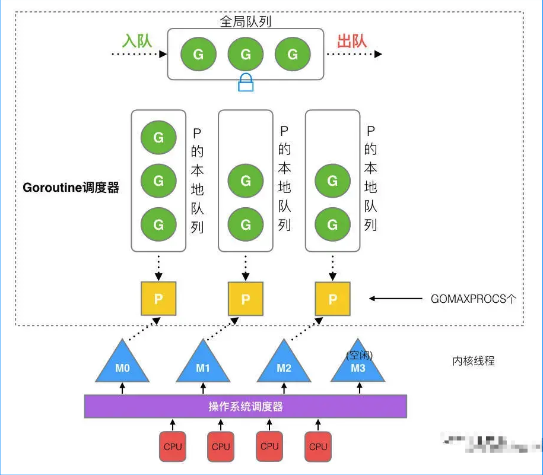

#### 1.多协程panic问题和协程嵌套recover问题  
在多协程并发环境下，我们常常会碰到以下问题，假设我们现在有2个协程，我们叫它们协程A和B。  
【问题1】如果协程A发生了panic，协程B是否会因为协程A的panic而挂掉？  
【问题2】如果协程A发生了panic，协程B是否能用recover捕获到协程A的panic？  
答案：会，不能。  
结论：协程A发生panic，协程B无法recover到协程A的panic，只有协程自己内部的recover才能捕获自己抛出的panic。
- 常见错误样例：[recover](https://github.com/miaoyc666/go-mistakes/blob/main/recover/main.go)
- 一种推荐的并发处理模型：[example](https://github.com/miaoyc666/go-mistakes/blob/main/recover/run.go)

#### 2.go有多少种锁？
两种锁类型，互斥锁（sync.Mutex）和读写锁（sync.RWMutex）
互斥锁有两种锁模式，正常模式和饥饿模式，有Lock和Unlock两种操作。
读写锁拱四种操作，读锁和写锁不能混用，同时只能存在写锁定或读锁定，读和写互斥
读锁定（RLock），对读操作进行锁定
读解锁（RUnlock），对读锁定进行解锁
写锁定（Lock），对写操作进行锁定
写解锁（Unlock），对写锁定进行解锁

#### 3.sync.Map内部使用了什么锁？
pass

#### 4.Go是传值还是传引用？
Go语言的一切都是值传递，没有引用传递。

#### 5.GPM模型是什么？
M运行G，G执行之后，M会从P获取下一个G，不断重复下去。
* M，代表一个内核线程，goroutine是跑在M之上的。线程想运行任务就得获取P，从P的本地队列获取G，P队列为空时，M也会尝试从全局队列拿一批G放到P的本地队列，或从其他P的本地队列偷一半放到自己P的本地队列。M运行G，G执行之后，M会从P获取下一个G，不断重复下去。
* P，processor，是 goroutine 执行所必须的上下文环境，可以理解为协程处理器，是用来执行 goroutine 的。processor 维护着可运行的 goroutine 队列，里面存储着所有需要它来执行的 goroutine。
* G，协程。

